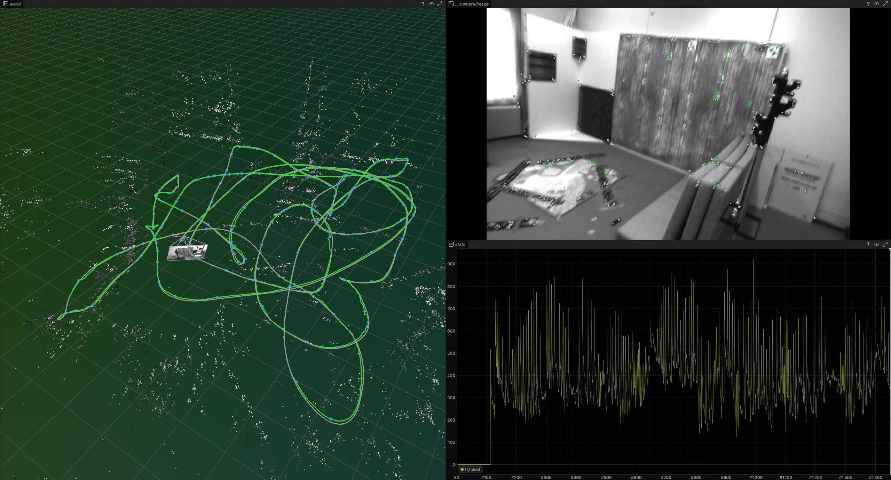

# slam2.0



Stereo visual SLAM built like ORB-SLAM2/3: tracking, local mapping and loop closing on three
threads. The difference is that the estimator is NumPy, not C++. It runs on drone footage (EuRoC)
and on a car (KITTI).

**EuRoC: 2 to 17 cm average error on 10 of 11 drone flights, 0 lost frames on 9 of them. KITTI 00:
1.74 m over 3.7 km.**

## Drone flights (EuRoC MAV)

EuRoC is 11 flights of a micro aerial vehicle through a machine hall and two Vicon rooms, with
millimetre ground truth from a laser tracker or motion capture. It is the standard benchmark for
drone SLAM, and it is much harder than driving: fast rotations, motion blur, dark corners and
textureless walls.

What it took to run on it:

- **Our own rectification.** KITTI ships rectified images. EuRoC ships raw images with strong lens
  distortion and a calibrated but unaligned stereo pair. We undistort and rectify both cameras
  from the calibration files, and keep track of the rotation this adds so poses still line up with
  the ground truth.
- **A test for the data, not just the code.** Before trusting any number, a test checks that the
  camera motion we see in the images agrees with the ground truth. It already paid off on KITTI,
  where a mislabeled mirror had spliced two sequences together.
- **Real-world camera problems.** Some flights drop frames: V2_03 loses every other left image
  during its fastest part. The motion model used to assume a fixed frame rate and predicted
  poses 2x off. It now works in seconds, not frames.
- **A loop closing bug KITTI never hit.** Hovering in one room makes many past views look alike.
  Candidate groups were being duplicated for every match, grew exponentially and ran out of
  memory on MH_01. Fixed to match ORB-SLAM2.

Results, camera only (no IMU yet). Error is ATE RMSE after aligning the trajectory to ground truth.

| Flight | Length | Our error | % of path | ORB-SLAM3 stereo | Lost frames |
|---|---|---|---|---|---|
| MH_01 easy | 81 m | 3.2 cm | 0.04 % | 2.9 cm | 0 |
| MH_02 easy | 73 m | 3.1 cm | 0.04 % | 1.9 cm | 0 |
| MH_03 medium | 131 m | 2.6 cm | 0.02 % | 2.4 cm | 0 |
| MH_04 difficult | 92 m | 17.2 cm | 0.19 % | 8.5 cm | 0 |
| MH_05 difficult | 98 m | 6.0 cm | 0.06 % | 5.2 cm | 0 |
| V1_01 easy | 59 m | **3.5 cm** | 0.06 % | 3.5 cm | 0 |
| V1_02 medium | 76 m | **2.1 cm** | 0.03 % | 2.5 cm | 0 |
| V1_03 difficult | 79 m | 8.5 cm | 0.11 % | 6.1 cm | 61 |
| V2_01 easy | 36 m | **2.9 cm** | 0.08 % | 4.1 cm | 0 |
| V2_02 medium | 84 m | 4.1 cm | 0.05 % | 2.8 cm | 0 |
| V2_03 difficult | 87 m | 272 cm | 3.1 % | 52.1 cm | 906 |

We match or beat ORB-SLAM3 on V1_01, V1_02 and V2_01, and stay close on most of the rest. Averaged
over the first ten flights it is 5.3 cm against their 4.0 cm. Runs at 8 to 14 fps on a laptop.

V2_03 is where we fail. A fast turn blurs the images, features drop from 1200 to 173, and the images
are sharp again 8 frames later, but tracking never comes back because there is no relocalization
yet. This is exactly the case an IMU fixes, which is what comes next
([`docs/vio-roadmap.md`](docs/vio-roadmap.md)).

## Driving (KITTI 00)


**1.74 m ATE over 3.7 km, 0.90 % drift, 0 lost frames, loops closed at all 4 real revisits, 6 fps.**
ORB-SLAM2 reports 1.30 m on the same sequence. Every learned SLAM system that publishes a KITTI 00
number is further off: DPV-SLAM++ 8.30 m, DROID-SLAM 92.1 m, DPVO 113.2 m (all monocular, which
explains part of that gap).


## What's different here

Python SLAM usually means a thin wrapper: g2o or Ceres does bundle adjustment, DBoW2 does place
recognition, and the Python is glue. Here the only C++ in the loop is OpenCV's ORB extractor.
Everything after it is array math you can read and step through:

- **Our own bundle adjustment.** Sparse Levenberg-Marquardt with the Schur complement, in about 200
  lines, batched over every observation at once. No g2o, no Ceres, no gtsam.
- **Matching without per-keypoint loops.** Hamming distance is a popcount lookup over whole
  descriptor arrays, and every search window reduces to `searchsorted` plus one index array.
- **Real place recognition.** The actual DBoW2 vocabulary (1.08 M nodes) parsed into flat arrays,
  loops verified with SE(3) RANSAC and closed with a pose graph.

Because the math is inspectable, the worst bugs were found by measuring, not guessing. Poses drifted
off SO(3) through roundoff until tracking exploded at frame 40 (g2o hides this behind quaternions),
and the pose graph was fighting its own loop correction because a drifted edge won deduplication
(ATE 5.23 m to 0.96 m once fixed).

## Architecture

```
frame -> tracking (main thread)
          ORB + stereo match · constant-velocity predict · project last frame's points
          motion-only BA · track local map · motion-only BA · keyframe decision
             │ keyframe
             ▼
          local mapping (thread)
          cull recent points · triangulate against covisible keyframes · fuse duplicates
          local BA over the covisible window, outer keyframes fixed · cull keyframes
             │ keyframe
             ▼
          loop closing (thread)
          BoW candidates + covisibility consistency · SE(3) RANSAC · fuse
          essential-graph pose graph
```

## Speed


Mapping costs about 430 ms per keyframe, so the only way to be fast is to get it off the tracking
thread. Four changes were measured, and two of them were thrown away:

| Change | Result | Kept? |
|---|---|---|
| Mapping and loop closing on worker threads | 1.1 to 6.4 fps | yes |
| Left/right ORB extraction in parallel | 51 to 43 ms per frame | yes |
| Dense Schur complement instead of sparse | 2408 to 2715 ms (slower) | no |
| Cap local BA at 12 covisible keyframes | no speedup, ATE 1.73 to 3.33 m | no |

## Run it

```bash
.venv/bin/pip install -e ".[dev]"
```

The vocabulary is ORB-SLAM3's `ORBvoc.txt` at `datasets/vocab/`, cached to `.npz` on first use.

**EuRoC.** Pulls single flights out of a Hugging Face mirror by byte range (about 1 GB each):

```bash
.venv/bin/python scripts/fetch_euroc.py MH_03_medium        # or: all
PATH="$PWD/.venv/bin:$PATH" .venv/bin/python scripts/run_kitti.py --dataset euroc --seq MH_03_medium
```

**KITTI.** Pulls one sequence out of the official zip by byte range (about 2.4 GB). Ground truth comes
from `data_odometry_poses.zip`.

```bash
.venv/bin/python scripts/fetch_kitti.py --seq 00
PATH="$PWD/.venv/bin:$PATH" .venv/bin/python scripts/run_kitti.py --seq 00
```

Add `--no-viz` for numbers only, or `--rrd outputs/run.rrd` to record and open later. Each run prints
ATE, fps, lost frames and loop closures, and writes the trajectory to `outputs/`.

## How it works

[`docs/slam2.0-architecture.pdf`](docs/slam2.0-architecture.pdf) is a 53-page walkthrough: the
geometry, the optimizer derived from scratch, and one camera frame followed through all three
threads, with code listings pulled straight from `src/slam/`. Rebuild it with
`.venv/bin/python scripts/build_notes.py` (needs `weasyprint`).

## Tests

```bash
PYTEST_DISABLE_PLUGIN_AUTOLOAD=1 .venv/bin/pytest -q
```

Includes the dataset checks for KITTI and EuRoC, a stereo-match gate against SGBM, solver tests with
20 % outliers, and a pose-graph loop-recovery test.
