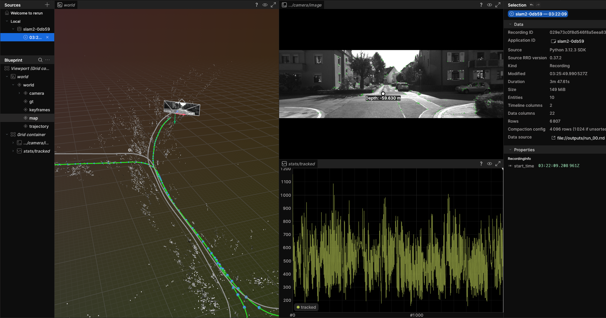
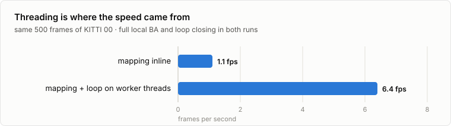
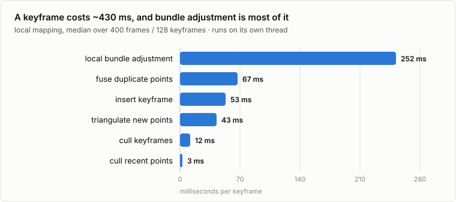
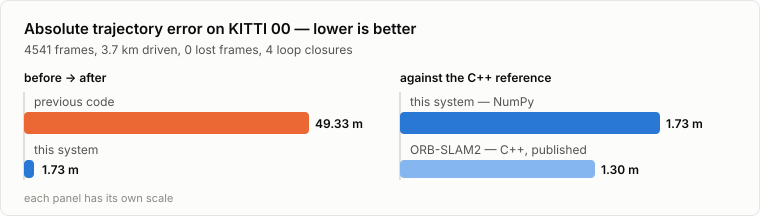
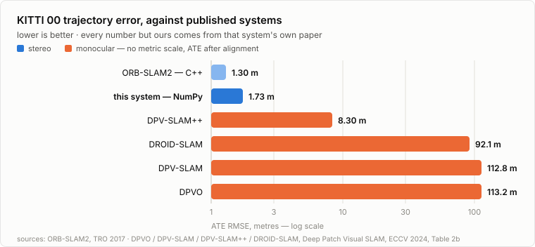

# slam2.0



Stereo visual SLAM on KITTI, built like ORB-SLAM2/3: tracking, local mapping and loop
closing on three threads, but the estimator is NumPy, not C++.

**1.73 m ATE over 3.7 km of KITTI 00. 0 lost frames. 4 loop closures, all at real revisits.
6 fps on a laptop.** ORB-SLAM2's paper reports 1.30 m on the same sequence.

## What's actually different here

Python SLAM usually means a thin wrapper: g2o or Ceres does bundle adjustment, DBoW2 does
place recognition, and the Python is glue. Here the only C++ in the loop is OpenCV's ORB
extractor. Everything after it is array math you can read and step through:

- **Our own bundle adjustment.** Sparse Levenberg–Marquardt with the Schur complement, in
  ~200 lines. Residuals and Jacobians are batched over every observation at once; the 3×3
  point blocks are inverted as one batched call; the reduced camera system goes to a sparse
  solve. No g2o, no Ceres, no gtsam.
- **Matching without per-keypoint loops.** Hamming distance is a popcount lookup table over
  whole descriptor arrays. Candidate pairs come from sorted ragged ranges (search windows,
  epipolar bands and vocabulary nodes) all reduce to `searchsorted` plus one flat index array.
- **Stereo the ORB-SLAM2 way, vectorized.** Row-band descriptor match, then SAD subpixel
  refinement computed for every match simultaneously, grouped by pyramid level.
- **Real place recognition.** The actual DBoW2 vocabulary (ORBvoc.txt, 1.08 M nodes) parsed
  into flat arrays; tree descent, TF-IDF and L1 scoring are vectorized. Loops are verified
  with SE(3) RANSAC and closed with an essential-graph pose graph.

The payoff is that the math is inspectable. Both bugs that cost us the most were found by
reading and measuring, not by guessing at a binary:

- Poses drifted off SO(3). The constant-velocity model composes `T @ invert(T_prev)`, and
  `invert()` assumes an orthonormal rotation, so roundoff tripled every frame until tracking
  exploded around frame 40. g2o hides this behind quaternions. Velocity is a twist now.
- The essential graph must take loop edges *before* strong-covisibility edges. Same keyframe
  pair, deduplicated, and the drifted measurement was winning, so the pose graph was fighting
  its own loop correction. ATE 5.23 m → 0.96 m.

There's also a test that checks the **dataset** rather than the code: it verifies that image
motion agrees with the ground-truth poses. It exists because half of our "sequence 00" turned
out to be sequence 01 from a mislabeled mirror, which cost days of debugging a SLAM system
that was fine.

## Architecture

```
frame -> tracking (main thread)
          ORB + stereo match · constant-velocity predict · project last frame's points
          motion-only BA · track local map · motion-only BA · keyframe decision
             │ keyframe
             ▼
          local mapping (thread)
          cull recent points · triangulate against covisible keyframes · fuse duplicates
          local BA over the covisible window, outer keyframes fixed · cull keyframes
             │ keyframe
             ▼
          loop closing (thread)
          BoW candidates + covisibility consistency · SE(3) RANSAC · fuse
          essential-graph pose graph
```

Poses are world-to-camera SE(3), left-perturbation `T ← exp(ξ)T`. Every frame stores its pose
relative to a reference keyframe, so bundle adjustment and loop corrections show up in the
trajectory instead of being lost.

## Speed



Tracking needs ~40 ms/frame and features ~43 ms. Mapping needs ~430 ms per keyframe, and a
keyframe arrives every ~3 frames, so the only way to be fast is to get mapping off the
tracking thread and let bundle adjustment run while the next frames track.



Two optimizations were measured and thrown away, which is the more useful half of the table:

| Change | Result | Kept? |
|---|---|---|
| Mapping + loop closing on worker threads | 1.1 → 6.4 fps | yes |
| Left/right ORB extraction in parallel | 51 → 43 ms per frame | yes |
| Dense Schur complement instead of sparse | 2408 → 2715 ms on real problems (slower) | no |
| Cap local BA at 12 covisible keyframes | no speedup at all, ATE 1.73 → 3.33 m | no |

The remaining bottleneck is the map lock: local mapping holds it ~175 ms per keyframe and
tracking stalls behind it. Median frame is 81 ms (12 fps); the mean is 130 ms.

## Accuracy



Translation drift 0.88 %, rotation drift 0.32 °/100 m, peak memory ~1 GB.

## Against published systems



We do not beat ORB-SLAM2: 1.73 m against its 1.30 m, 0.88 % against 0.70 %, 0.32 against
0.25 °/100 m. What this does beat is every learned SLAM system that publishes a KITTI 00
number: DPV-SLAM++ at 8.30 m, DROID-SLAM at 92.1 m, DPVO at 113.2 m.

Those systems are monocular, and a single camera gives no metric scale, so stereo explains a
good part of that gap. The honest reading is the placement, not the ratio: a SLAM system whose
estimator is NumPy lands in the classical-stereo accuracy band rather than the learned-monocular
one, on a 3.7 km sequence, at 6 fps.

## Get KITTI and run it

```bash
.venv/bin/pip install -e ".[dev]"
.venv/bin/python scripts/fetch_kitti.py --seq 00        # ~2.4 GB, pulled out of the official zip by byte range
```

Ground-truth poses come from `data_odometry_poses.zip`; the vocabulary is ORB-SLAM3's
`ORBvoc.txt` at `datasets/vocab/` (cached to `.npz` on first use).

```bash
PATH="$PWD/.venv/bin:$PATH" .venv/bin/python scripts/run_kitti.py --seq 00   # live Rerun viewer
.venv/bin/python scripts/run_kitti.py --seq 00 --no-viz                      # numbers only
.venv/bin/python scripts/run_kitti.py --seq 00 --rrd outputs/run.rrd         # record, open later
```

Prints ATE, KITTI RPE, fps and the frames where loops closed; writes `outputs/traj_00.txt`
in KITTI pose format.

## Tests

```bash
PYTEST_DISABLE_PLUGIN_AUTOLOAD=1 .venv/bin/pytest -q
```

Includes the dataset integrity check, a stereo-match gate against SGBM, solver tests with
20 % outliers, and a pose-graph loop-recovery test.
